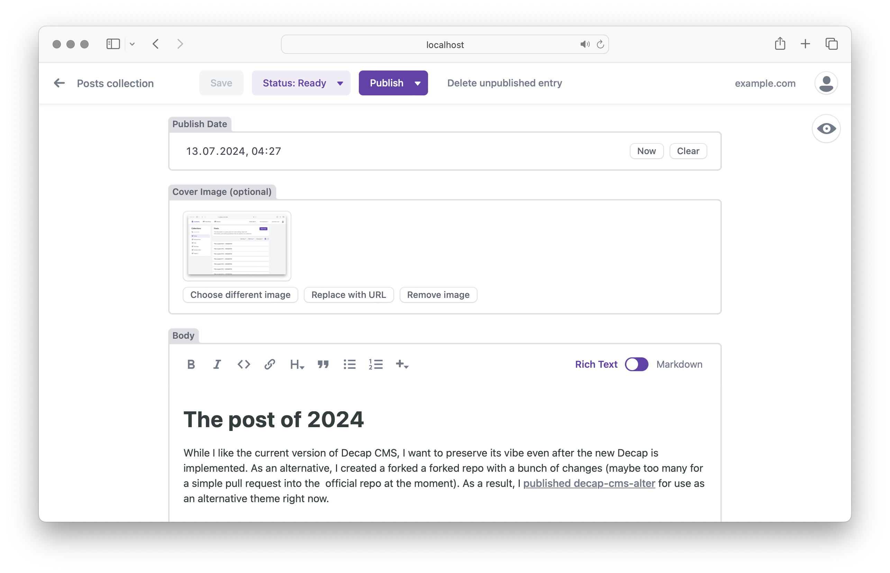

# Alternative Decap CMS Package
This package is built on top of the [forked Decap CMS](https://github.com/olegfedak/decap-cms). As a new version of the Decap interface is being implemented, I aim to preserve the existing user experience. This alternative version maintains the same Decap functionality and the classic old theme style with a few minor fixes.


<details>
  <summary> +2 screenshots</summary>

  
  
</details>

## Theme In General
1. Optimized for the mobile.
2. Widgets are displayed in a single view.
3. Minor fixes and simplification of UI.
4. The CMS accent color can be customized.

## Just try it
For the testing include the link of the packege into your `admin/index.html` instead of the official one. Or, you can download this package to your project's admin folder and then link to it.

`/admin/index.html`:

```html
<!-- <body> -->
    <!-- <script src="https://unpkg.com/decap-cms@^3.1.11/dist/decap-cms.js"></script> -->
    <script src="https://unpkg.com/decap-cms-alter@^3.1.11/dist/decap-cms.js"></script>
  </body>
<!-- </body> -->
```

## Your own ccent
Add the color to the head of `admin/index.html` in `HEX` format. For example:
```html
<!-- <head> -->
  <style>
    :root {
      --accent: #683bab !important;
      --accent-light: #683bab19 !important;
    }
  </style>
<!-- </head> -->
```
Note: `19` in `--accent-light` is the alpha value. `!important` must be. This approach is necessary measure until the ability to customize the Theme Config is implemented.

## Next ToDo
- Dark Mode
- Theme Config

## Resolved
— [fix: clear field error in Editor after the field value is changed](https://github.com/decaporg/decap-cms/pull/7216)

## Full Install and Configuration
If you are not familiar with Decap CMS, please read the [official install guide](https://decapcms.org/docs/install-decap-cms/).

## Decap Version
Currently are tested on v3.1.11
