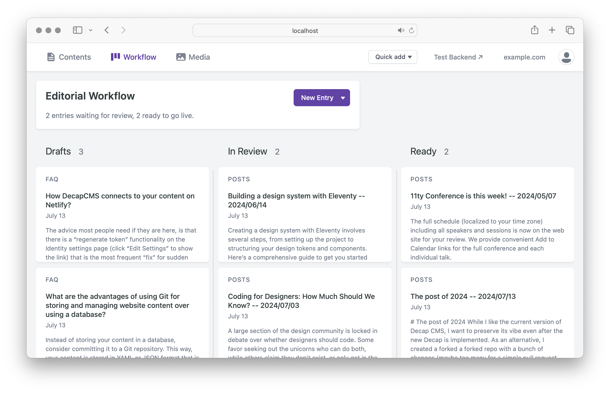

# Alternative Decap CMS Package
This package is built on top of the [forked Decap CMS](https://github.com/olegfedak/decap-cms). As a new version of the Decap interface is being implemented, I aim to preserve the existing user experience. This alternative version maintains the same Decap functionality and the classic old theme style with a few minor fixes.




## In General
1. Optimized for the mobile.
2. Widgets are displayed in a single view.
3. Minor fixes and simplification of UI.
4. The CMS accent color can be customized.

## Just try it
For the testing include the link `https://olegfedak.github.io/decap-cms-alter/decap-cms.js` into your `admin/index.html` instead of the official one:

```html
<!DOCTYPE html>
<html>
  <head>
    <meta charset="utf-8" />
    <meta name="viewport" content="width=device-width, initial-scale=1.0" />
    <meta name="robots" content="noindex" />
    <title>Content Manager</title>
  </head>
  <body>
    <!-- <script src="https://unpkg.com/decap-cms@^3.1.10/dist/decap-cms.js"></script> -->
    <script src="https://olegfedak.github.io/decap-cms-alter/decap-cms.js"></script>

  </body>
</html>
```

## Your own ccent color
Add the color to the head of `admin/index.html` in `HEX` format. For example:
```html
<!-- <head> -->
  <style>
    :root {
      --accent: "#683bab"
      --accent-color: "#683bab19"
    }
  </style>
<!-- </head> -->
```
Note: `19` in `--accent-color` is the alpha value.

## Next ToDo
- Dark mode

## Resolved
— [fix: clear field error in Editor after the field value is changed](https://github.com/decaporg/decap-cms/pull/7216)

## Help
If you are not familiar with Decap CMS, please read the [official install guide](https://decapcms.org/docs/install-decap-cms/).


## Versions
Currently are tested on v3.1.10
